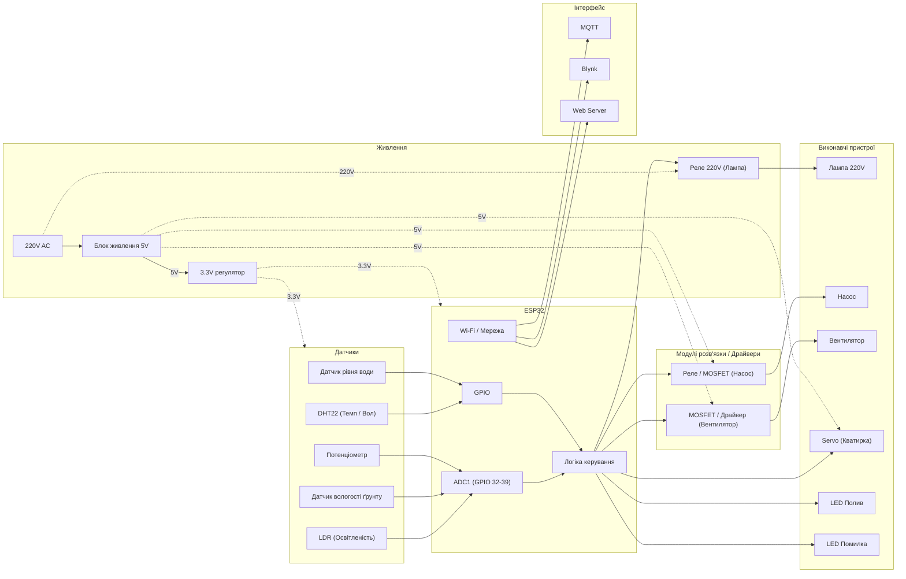

# ESP32 Greenhouse Controller

This project includes a high-level system diagram for the greenhouse controller.

## System diagram

```mermaid
flowchart LR

%% ==========================
%% POWER
%% ==========================

subgraph PWR["Живлення"]
    AC["220V AC"]
    PSU["Блок живлення 5V"]
    REG["3.3V регулятор"]

    AC --> PSU
    PSU -->|"5V"| REG
    AC -.->|"220V"| RELAY_LAMP
end

%% ==========================
%% INPUTS
%% ==========================

subgraph IN["Датчики"]
    LDR["LDR (Освітленість)"]
    SOIL["Датчик вологості ґрунту"]
    POT["Потенціометр"]
    DHT["DHT22 (Темп / Вол)"]
    WATER["Датчик рівня води"]
end

%% ==========================
%% CONTROLLER
%% ==========================

subgraph ESP["ESP32"]
    ADC1["ADC1 (GPIO 32-39)"]
    GPIO["GPIO"]
    WIFI["Wi-Fi / Мережа"]
    LOGIC["Логіка керування"]
end

LDR --> ADC1
SOIL --> ADC1
POT --> ADC1

DHT --> GPIO
WATER --> GPIO

ADC1 --> LOGIC
GPIO --> LOGIC

%% ==========================
%% DRIVERS & ACTUATORS
%% ==========================

subgraph DRIVERS["Модулі розв'язки / Драйвери"]
    RELAY_LAMP["Реле 220V (Лампа)"]
    RELAY_PUMP["Реле / MOSFET (Насос)"]
    RELAY_FAN["MOSFET / Драйвер (Вентилятор)"]
end

subgraph OUT["Виконавчі пристрої"]
    LAMP["Лампа 220V"]
    PUMP["Насос"]
    FAN["Вентилятор"]
    SERVO["Servo (Кватирка)"]
    LEDG["LED Полив"]
    LEDR["LED Помилка"]
end

LOGIC --> RELAY_LAMP --> LAMP
LOGIC --> RELAY_PUMP --> PUMP
LOGIC --> RELAY_FAN --> FAN
LOGIC --> SERVO
LOGIC --> LEDG
LOGIC --> LEDR

%% ==========================
%% WEB
%% ==========================

subgraph WEB["Інтерфейс"]
    MQTT["MQTT"]
    BLYNK["Blynk"]
    WEBUI["Web Server"]
end

WIFI --> MQTT
WIFI --> BLYNK
WIFI --> WEBUI

%% ==========================
%% POWER LINES
%% ==========================

REG -."3.3V".-> ESP
REG -."3.3V".-> IN

PSU -."5V".-> SERVO
PSU -."5V".-> RELAY_PUMP
PSU -."5V".-> RELAY_FAN
```
