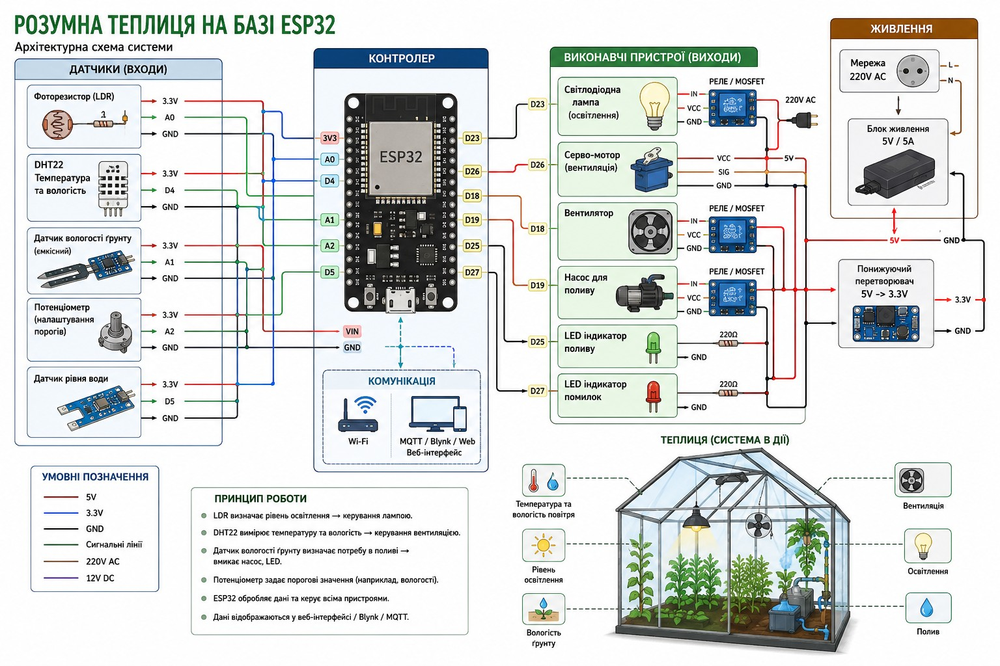

# ESP32 Smart Greenhouse Controller (Розумна Теплиця)

An automated microclimate management and monitoring system for greenhouses powered by an ESP32 microcontroller, featuring modular object-oriented firmware architecture, dual operating modes (Automatic & Manual), safety indicators, and interactive OLED display / IoT connectivity options.



> **Note**: The architectural diagram above serves as a high-level concept illustration of an automated greenhouse system. The section below documents the **actual pinout and implementation** as coded in the project firmware.

---

## 📋 Table of Contents

- [System Overview](#-system-overview)
- [Actual Hardware Implementation & Pinout](#-actual-hardware-implementation--pinout)
- [Power Supply Architecture](#-power-supply-architecture)
- [Firmware Architecture & Software Services](#-firmware-architecture--software-services)
- [Control Logic & Hysteresis Algorithms](#-control-logic--hysteresis-algorithms)
- [Operating Modes](#-operating-modes)
- [Building & Wokwi Simulation](#-building--wokwi-simulation)
- [Possible Enhancements & Roadmap](#-possible-enhancements--roadmap)
- [File Structure](#-file-structure)

---

## 🌿 System Overview

The **ESP32 Smart Greenhouse Controller** continuously monitors critical environmental parameters—soil moisture, ambient air temperature, relative humidity, and ambient light levels—to dynamically manage greenhouse actuators (irrigation pump, ventilation window servo, and supplemental growth lights).

### Key Features:
- **Autonomous Climate Control**: Automatic triggering of ventilation, irrigation, and supplemental lighting based on customizable thresholds with hysteresis prevention.
- **Manual Override Mode**: Advisory-only safety policy in manual mode; critical hazards still raise alarms while the operator retains full manual actuator control using dedicated push-buttons.
- **Diagnostics & Safety**: Dual LED indicators (`LED_GREEN` for nominal operation, `LED_RED` for sensor errors) and acoustic alerts (`Buzzer`) for emergency states.
- **Visual Feedback**: Real-time sensor metrics and status displayed on an I2C OLED display (SSD1306) managed by [DisplayManager](file:///Users/oleksiizozulenko/Documents/PlatformIO/Projects/esp32-greenhouse-controller/lib/Services/include/DisplayManager.h).
- **FreeRTOS Dual-Core Thread Safety**: `healthStateMutex` synchronizes cross-core data exchange between Core 1 (`vTaskControl`) and Core 0 (`vTaskDisplay`).
- **Zero Runtime Heap Churn**: Static fixed-size allocation (`MAX_SENSORS = 16`, `MAX_ACTUATORS = 16`) eliminates memory fragmentation and OOM crashes.
- **Modular PlatformIO `lib/` Architecture**: Driver declarations (`.h`) and implementations (`.cpp`) are strictly separated into self-contained static libraries inside `lib/`.

---

## 🔌 Actual Hardware Implementation & Pinout

The system is configured around the ESP32 board pinout defined in [include/config.h](file:///Users/oleksiizozulenko/Documents/PlatformIO/Projects/esp32-greenhouse-controller/include/config.h). For a detailed wiring guide, schematics, and power architecture, see the [Hardware Connection Schema & Wiring Guide](file:///Users/oleksiizozulenko/Documents/PlatformIO/Projects/esp32-greenhouse-controller/docs/hardware_connection_schema.md).

### Inputs (Sensors & Buttons)

| Sensor / Button | Config Constant | GPIO Pin | Interface Type | Description |
| :--- | :--- | :--- | :--- | :--- |
| **DHT11 / DHT22 Temp & Humidity** | `PIN_DHT` | `GPIO 23` | Digital (1-Wire) | Measures air temperature (°C) and humidity (%) |
| **LDR Photoresistor** | `PIN_LDR` | `GPIO 35` | Analog (ADC1_CH7) | Measures ambient light intensity |
| **Soil Moisture Sensor** | `PIN_SOIL_POT` | `GPIO 34` | Analog (ADC1_CH6) | Capacitive / analog soil moisture reading (%) |
| **Mode Selector Button** | `PIN_BTN_MODE` | `GPIO 32` | Digital Input (Pullup) | Toggles between AUTO and MANUAL system modes |
| **Irrigation Manual Button** | `PIN_BTN_IRRIG` | `GPIO 14` | Digital Input (Pullup) | Manual toggle for irrigation pump |
| **Ventilation Manual Button** | `PIN_BTN_VENT` | `GPIO 27` | Digital Input (Pullup) | Manual toggle for window servo |
| **Light Manual Button** | `PIN_BTN_LIGHT` | `GPIO 26` | Digital Input (Pullup) | Manual toggle for growth lighting |

### Outputs (Actuators & Status Indicators)

| Actuator / Component | Config Constant | GPIO Pin | Output Type | Description |
| :--- | :--- | :--- | :--- | :--- |
| **Ventilation Window Servo** | `PIN_ACTUATOR_VENT` | `GPIO 13` | Servo PWM | Roof vent position ($0^\circ$ closed, $90^\circ$ open) |
| **Irrigation Actuator / Pump** | `PIN_ACTUATOR_IRRIG` | `GPIO 33` | Digital (Active-LOW) | 8x8 Dot Matrix / Relay for irrigation pump |
| **Growth Light Actuator** | `PIN_ACTUATOR_LIGHT` | `GPIO 25` | Digital Output | Yellow LED / Relay for supplemental lighting |
| **Status LED: Normal System** | `PIN_LED_GREEN` | `GPIO 15` | Digital Output | Green indicator for nominal system state |
| **Status LED: System Error** | `PIN_LED_RED` | `GPIO 4` | Digital Output | Red indicator for sensor read errors |
| **Acoustic Alert Buzzer** | `PIN_BUZZER` | `GPIO 18` | PWM / Tone | Audible alarm for out-of-bounds readings |
| **OLED Display SDA** | `PIN_OLED_SDA` | `GPIO 21` | I2C Data | SSD1306 OLED display data bus |
| **OLED Display SCL** | `PIN_OLED_SCL` | `GPIO 22` | I2C Clock | SSD1306 OLED display clock bus |

> *Note for Wokwi Simulation*: The virtual simulation circuit in [diagram.json](file:///Users/oleksiizozulenko/Documents/PlatformIO/Projects/esp32-greenhouse-controller/diagram.json) maps simulation-specific visual peripherals (Mode on GPIO 12, DHT on GPIO 19, Servo on GPIO 5, Strip on GPIO 17, Ring on GPIO 16).

---

## ⚡ Power Supply Architecture

1. **Main 5V DC Supply Rail**:
   - Supplies power to high-current components: Servo motor (`GPIO 13`), Irrigation Actuator (`GPIO 33`), Growth Lighting (`GPIO 25`), and Relays.
   - Feeds into the ESP32 `VIN` pin.
2. **ESP32 Internal 3.3V Regulator**:
   - Supplies regulated 3.3V DC to analog sensors (LDR, Capacitive Soil Moisture) and digital sensors (DHT22) to ensure precise ADC readings and signal stability.

---

## 🧠 Firmware Architecture & Software Services

The controller firmware uses a clean modular architecture split into self-contained libraries inside PlatformIO's [`lib/`](file:///Users/oleksiizozulenko/Documents/PlatformIO/Projects/esp32-greenhouse-controller/lib) folder, with strict separation between `.h` declarations and `.cpp` implementations:

```text
src/
└── main.cpp                        # Application entrypoint & FreeRTOS task composition
include/
└── config.h                        # Central pin definitions, thresholds & constants
lib/
├── Actuators/                      # Actuator Abstraction & Hardware Drivers
│   ├── include/ (Actuator.h, VentilationActuator.h, IrrigationActuator.h, LightActuator.h)
│   └── src/     (Actuator.cpp, VentilationActuator.cpp, IrrigationActuator.cpp, LightActuator.cpp)
├── Sensors/                        # Sensor Abstraction & Hardware Drivers
│   ├── include/ (Sensor.h, HumiditySensor.h, SoilSensor.h, TemperatureSensor.h, LightSensor.h)
│   └── src/     (Sensor.cpp, HumiditySensor.cpp, SoilSensor.cpp, TemperatureSensor.cpp, LightSensor.cpp)
├── Buttons/                        # Button Driver & ISR Event Handlers
│   ├── include/ (ButtonDriver.h, ButtonEvent.h, ButtonType.h, IButtonListener.h)
│   └── src/     (ButtonDriver.cpp)
├── Filters/                        # Signal Processing & Noise Filters
│   ├── include/ (ISensorFilter.h, MedianFilter.h, KaufmanFilter.h, SlewRateLimiter.h, CompositeFilter.h)
│   └── src/     (SlewRateLimiter.cpp, CompositeFilter.cpp)
├── Services/                       # Application Domain Services
│   ├── include/ (SensorsService.h, SafetyMonitorService.h, DisplayManager.h, DisplayViewModel.h)
│   └── src/     (SensorsService.cpp, SafetyMonitorService.cpp, DisplayManager.cpp)
└── Controller/                     # State Machine & Control Rules
    ├── include/ (GreenhouseController.h)
    └── src/     (GreenhouseController.cpp)
```

### Core Services:
- **[SensorsService](file:///Users/oleksiizozulenko/Documents/PlatformIO/Projects/esp32-greenhouse-controller/lib/Services/include/SensorsService.h)**: Polling manager that samples registered sensors periodically (`SENSOR_READ_INTERVAL`), packages values into a static `SensorDataMap`, and uses fixed inline storage (`MAX_SENSORS = 16`) for zero heap churn.
- **[SafetyMonitorService](file:///Users/oleksiizozulenko/Documents/PlatformIO/Projects/esp32-greenhouse-controller/lib/Services/include/SafetyMonitorService.h)**: Evaluates typed `SensorType` readings against domain thresholds and produces `SystemHealthState` for advisory/alarm handling.
- **[GreenhouseController](file:///Users/oleksiizozulenko/Documents/PlatformIO/Projects/esp32-greenhouse-controller/lib/Controller/include/GreenhouseController.h)**: Drives automatic actuator logic or manual button toggles using typed `ActuatorType` identity (`MAX_ACTUATORS = 16`), with a sticky debounced mode button switching between `MANUAL` and `AUTOMATIC`.
- **[DisplayManager](file:///Users/oleksiizozulenko/Documents/PlatformIO/Projects/esp32-greenhouse-controller/lib/Services/include/DisplayManager.h)**: Renders live metrics, current active mode, and error banners on the 128x64 SSD1306 OLED screen.

---

## ⚙️ Control Logic & Hysteresis Algorithms

To prevent rapid relay switching or servo chatter when sensor readings hover near threshold boundaries, the system incorporates hysteresis margins defined in [include/config.h](file:///Users/oleksiizozulenko/Documents/PlatformIO/Projects/esp32-greenhouse-controller/include/config.h):

1. **Temperature & Ventilation Control**:
   - **Turn ON (Open Vent)**: `Temperature > 28.0°C` (`TEMP_THRESHOLD_HIGH`) $\rightarrow$ Servo opens window to $90^\circ$.
   - **Turn OFF (Close Vent)**: `Temperature < 26.0°C` (`TEMP_THRESHOLD_HIGH - TEMP_HYSTERESIS`) $\rightarrow$ Servo closes window to $0^\circ$.

2. **Soil Moisture & Irrigation Control**:
   - **Turn ON (Start Watering)**: `Soil Moisture < 30%` (`SOIL_DRY_THRESHOLD`) $\rightarrow$ Activate irrigation pump.
   - **Turn OFF (Stop Watering)**: `Soil Moisture > 35%` (`SOIL_DRY_THRESHOLD + SOIL_HYSTERESIS`) $\rightarrow$ Deactivate irrigation pump.

3. **Ambient Light & Growth Lighting**:
   - **Turn ON (Light ON)**: `Light Level < 3000 lx` (`LIGHT_DARK_THRESHOLD`) $\rightarrow$ Turn ON growth lighting strip.
   - **Turn OFF (Light OFF)**: `Light Level > 3500 lx` (`LIGHT_DARK_THRESHOLD + LIGHT_HYSTERESIS`) $\rightarrow$ Turn OFF growth lighting strip.

---

## 🔄 Operating Modes

System mode is determined by the state of the Mode Button (`PIN_BTN_MODE`):

- **Automatic Mode (`SystemMode::AUTOMATIC`)**:
  - The [GreenhouseController](file:///Users/oleksiizozulenko/Documents/PlatformIO/Projects/esp32-greenhouse-controller/lib/Controller/include/GreenhouseController.h) autonomously controls ventilation, irrigation, and lighting based on typed sensor readings.
  - High-temperature or dry-soil warnings trigger the acoustic alert (`Buzzer`).

- **Manual Mode (`SystemMode::MANUAL`)**:
  - Automatic threshold triggers are bypassed.
  - Users can manually toggle irrigation, ventilation, and lighting on/off using the dedicated hardware push-buttons (`PIN_BTN_IRRIG`, `PIN_BTN_VENT`, `PIN_BTN_LIGHT`).
  - Critical hazards remain advisory/alarm-only in manual mode while the operator keeps direct actuator control.
  - Safety timers automatically auto-shutoff manually triggered actuators after designated safety intervals (`IRRIGATION_TIMEOUT_MS = 10000`, `VENTILATION_TIMEOUT_MS = 30000`, `LIGHT_TIMEOUT_MS = 60000`).

---

## 🛠️ Building & Unit Testing

### Building with PlatformIO

```bash
# Build firmware binary
pio run

# Upload to ESP32 board
pio run --target upload

# Open serial monitor (115200 baud)
pio device monitor
```

### Running Native Unit Tests

```bash
# Run native Desktop C++ unit tests (68 test cases across 5 test suites)
pio test -e native
```

---

## 🚀 Possible Enhancements & Roadmap

The current architecture provides a robust foundation for future expansions:

### 1. Wireless IoT Telemetry & Remote Control
- **MQTT Integration**: Publish sensor telemetry to Home Assistant / ThingsBoard / Node-RED and subscribe to remote control topics.
- **Web Interface (ESPAsyncWebServer)**: Host an onboard web dashboard with real-time graphs and remote configuration sliders.
- **Blynk IoT App Support**: Mobile app control for remote parameter adjustments and push notifications.

### 2. Advanced Climate & Fertigation Control
- **PID Ventilation Control**: Replace binary servo open/close logic ($0^\circ / 90^\circ$) with a Proportional-Integral-Derivative (PID) algorithm for smooth, step-less window positioning based on temperature rate of change.
- **Automated Fertigation (Nutrient Dosing)**: Integrate pH and EC (Electro-Conductivity) sensors with peristaltic pumps for automated liquid fertilizer injection into the irrigation line.
- **CO2 Monitoring & Enrichment**: Add NDIR CO2 sensors (e.g. MH-Z19B) to control CO2 generator relays during peak photosynthetic hours.

---

## 📁 File Structure

```text
.
├── README.md               # Firmware Specifications & Documentation
├── platformio.ini          # PlatformIO environment & build configuration
├── diagram.json            # Wokwi simulation diagram setup
├── wokwi.toml              # Wokwi simulation settings
├── include/                # Global configuration & pin definitions
│   └── config.h
├── lib/                    # Modular PlatformIO Libraries
│   ├── Actuators/
│   ├── Sensors/
│   ├── Buttons/
│   ├── Filters/
│   ├── Services/
│   └── Controller/
├── src/                    # Application Entrypoint & RTOS Tasks
│   └── main.cpp
└── test/                   # Native Unit Test Suites
    ├── test_buttons/
    ├── test_drivers/
    ├── test_filters/
    ├── test_greenhouse_controller/
    └── test_sensors_service/
```
