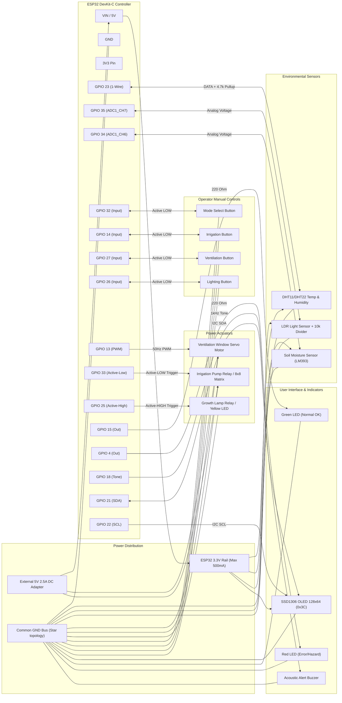

# ESP32 Greenhouse Controller - Hardware Connection Schema & Wiring Guide

This document provides the complete hardware connection schema, electrical wiring diagrams, power distribution architecture, and pin allocation specifications for the **ESP32 Smart Greenhouse Controller**.

---

## 📋 Table of Contents

1. [Master Pin Allocation Map](#1-master-pin-allocation-map)
2. [ESP32 DevKit-C Pinout Diagram](#2-esp32-devkit-c-pinout-diagram)
3. [Power Distribution Architecture](#3-power-distribution-architecture)
4. [Detailed Wiring Schematics by Subsystem](#4-detailed-wiring-schematics-by-subsystem)
    - [4.1 Sensors (Microclimate & Soil)](#41-sensors-microclimate--soil)
    - [4.2 Actuators (Ventilation, Irrigation, Lighting)](#42-actuators-ventilation-irrigation-lighting)
    - [4.3 User Controls (Push Buttons)](#43-user-controls-push-buttons)
    - [4.4 Visual & Acoustic Indicators](#44-visual--acoustic-indicators)
    - [4.5 I2C OLED Display](#45-i2c-oled-display)
5. [Complete System Mermaid Wiring Schematic](#5-complete-system-mermaid-wiring-schematic)
6. [Bench Assembly & Breadboard Checklist](#6-bench-assembly--breadboard-checklist)
7. [Electrical Protection & Best Practices](#7-electrical-protection--best-practices)

---

## 1. Master Pin Allocation Map

The pin assignments below correspond to the physical hardware configuration defined in [`include/config.h`](../include/config.h) and [`docs/specs/actuators-and-overrides/spec.md`](specs/actuators-and-overrides/spec.md).

| Function / Component          | Config Constant      | ESP32 GPIO  | Interface Type   | Electrical Logic / Levels                         | External Components Needed                             |
| :---------------------------- | :------------------- | :---------- | :--------------- | :------------------------------------------------ | :----------------------------------------------------- |
| **DHT11 / DHT22 Sensor**      | `PIN_DHT`            | **GPIO 23** | Digital (1-Wire) | 3.3V Logic                                        | $4.7\text{k}\Omega - 10\text{k}\Omega$ pull-up to 3.3V |
| **LDR Light Sensor**          | `PIN_LDR`            | **GPIO 35** | Analog Input     | ADC1_CH7 ($0 - 3.3\text{V}$)                      | $10\text{k}\Omega$ pull-down divider resistor          |
| **Soil Moisture Sensor**      | `PIN_SOIL_POT`       | **GPIO 34** | Analog Input     | ADC1_CH6 ($0 - 3.3\text{V}$)                      | Analog Out of LM393 / Capacitive probe                 |
| **Mode Toggle Button**        | `PIN_BTN_MODE`       | **GPIO 32** | Digital Input    | Active-LOW (`INPUT_PULLUP`)                       | Connect to GND on press                                |
| **Irrigation Manual Button**  | `PIN_BTN_IRRIG`      | **GPIO 14** | Digital Input    | Active-LOW (`INPUT_PULLUP`)                       | Connect to GND on press                                |
| **Ventilation Manual Button** | `PIN_BTN_VENT`       | **GPIO 27** | Digital Input    | Active-LOW (`INPUT_PULLUP`)                       | Connect to GND on press                                |
| **Lighting Manual Button**    | `PIN_BTN_LIGHT`      | **GPIO 26** | Digital Input    | Active-LOW (`INPUT_PULLUP`)                       | Connect to GND on press                                |
| **Ventilation Servo**         | `PIN_ACTUATOR_VENT`  | **GPIO 13** | 50Hz PWM Output  | $0^\circ (\text{Close}) - 90^\circ (\text{Open})$ | External 5V rail + $100\mu\text{F}$ cap                |
| **Irrigation Actuator**       | `PIN_ACTUATOR_IRRIG` | **GPIO 33** | Digital Output   | **Active-LOW** (8x8 Matrix / Relay)               | Relay driver / 8x8 LED module                          |
| **Growth Light Actuator**     | `PIN_ACTUATOR_LIGHT` | **GPIO 25** | Digital Output   | Active-HIGH (Yellow LED / Relay)                  | $220\Omega$ resistor / Relay module                    |
| **System Normal LED**         | `PIN_LED_GREEN`      | **GPIO 15** | Digital Output   | Active-HIGH (Solid ON)                            | $220\Omega - 330\Omega$ resistor to GND                |
| **System Error LED**          | `PIN_LED_RED`        | **GPIO 4**  | Digital Output   | Active-HIGH (Alert/Hazard)                        | $220\Omega - 330\Omega$ resistor to GND                |
| **Acoustic Alert Buzzer**     | `PIN_BUZZER`         | **GPIO 18** | PWM / Tone       | Active-HIGH (1 kHz Tone)                          | NPN transistor (2N2222) or Piezo                       |
| **OLED Display SDA**          | `PIN_OLED_SDA`       | **GPIO 21** | I2C Data         | 3.3V / 5V Tolerant (Addr: `0x3C`)                 | On-board I2C pull-ups ($4.7\text{k}\Omega$)            |
| **OLED Display SCL**          | `PIN_OLED_SCL`       | **GPIO 22** | I2C Clock        | 3.3V / 5V Tolerant (Addr: `0x3C`)                 | On-board I2C pull-ups ($4.7\text{k}\Omega$)            |

---

## 2. ESP32 DevKit-C Pinout Diagram

Below is the ASCII connection diagram mapping physical pins on the ESP32 DevKit-C (38-pin version):

```text
                            +-------------------+
                     3.3V --| 3V3           GND |-- GND  <--- Common Ground Bus
                    RESET --| EN             23 |-- GPIO 23 <--- DHT11/DHT22 Data
                      NC  --| VP (36)        22 |-- GPIO 22 <--- OLED SCL (I2C)
                      NC  --| VN (39)         1 |-- TXD0 (Serial Monitor)
  Soil Moisture AO -------> | 34 (ADC1_CH6)   3 |-- RXD0 (Serial Monitor)
  LDR Light Sensor AO ----> | 35 (ADC1_CH7)  21 |-- GPIO 21 <--- OLED SDA (I2C)
  Mode Button (to GND) ---> | 32            GND |-- GND
  Irrigation Actuator <---- | 33 (Active-L)  19 |-- NC
  Growth Light Actuator <-- | 25             18 |-- GPIO 18 ---> Buzzer
  Light Button (to GND) --> | 26              5 |-- NC
  Vent Button (to GND) ---> | 27             17 |-- NC
  Irrig Button (to GND) --> | 14             16 |-- NC
                      NC  --| 12              4 |-- GPIO 4  ---> Red LED (System Error)
              Common GND --| GND             0 |-- BOOT Button
   Ventilation Servo PWM <- | 13              2 |-- NC (Onboard LED)
                      NC  --| 9              15 |-- GPIO 15 ---> Green LED (System OK)
                      NC  --| 10              8 |-- NC
                      NC  --| 11              7 |-- NC
    +5V External In ------| VIN             6 |-- NC
                            +-------------------+
```

---

## 3. Power Distribution Architecture

Stable power distribution is essential for greenhouse controllers to prevent ESP32 brownout resets during servo motion or relay switching.

```text
+-----------------------------------------------------------------------------------+
|                            EXTERNAL 5V / 2A-3A DC POWER SUPPLY                    |
+-----------------------------------------------------------------------------------+
       |                                                    |
       | (+5V DC Rail)                                      | (0V / Common Ground)
       v                                                    v
+------------------+                                +-------------------------------+
| ESP32 DevKit VIN |                                | COMMON SYSTEM GROUND (GND)    |
| (Onboard 3.3V    |                                | (Star Topology - Single Point)|
|  LDO Regulator)  |                                +-------------------------------+
+------------------+                                                ^
   |           |                                                    |
   | (+3.3V)   +----------------------------------------------------+
   v
+-----------------------------+
| SENSITIVE 3.3V SENSOR BUS   |
| - DHT11 / DHT22 VCC         |
| - LDR Voltage Divider VCC   |
| - Soil Moisture Sensor VCC  |
| - SSD1306 OLED VCC          |
+-----------------------------+
```

### Power Specifications & Current Budget:

| Subsystem / Load                  | Supply Rail   | Typical Current | Peak / Inrush Current          | Decoupling / Filtering                                                    |
| :-------------------------------- | :------------ | :-------------- | :----------------------------- | :------------------------------------------------------------------------ |
| **ESP32 DevKit (CPU + WiFi/BT)**  | 5V via VIN    | $80\text{ mA}$  | $240\text{ mA}$                | On-board ceramic bypass caps                                              |
| **Ventilation Servo Motor**       | External 5V   | $100\text{ mA}$ | $800\text{ mA} - 1.2\text{ A}$ | $100\mu\text{F} - 470\mu\text{F}$ Electrolytic + $0.1\mu\text{F}$ Ceramic |
| **8x8 Matrix / Irrigation Relay** | External 5V   | $60\text{ mA}$  | $250\text{ mA}$                | Flyback diode (1N4007) across relay coil                                  |
| **Growth Light (LED/Relay)**      | 3.3V / 5V     | $20\text{ mA}$  | $80\text{ mA}$                 | Current limiting resistor                                                 |
| **SSD1306 OLED Display**          | 3.3V Rail     | $15\text{ mA}$  | $25\text{ mA}$                 | On-module filtering                                                       |
| **Status LEDs (Green + Red)**     | 3.3V Rail     | $15\text{ mA}$  | $30\text{ mA}$                 | $220\Omega$ current limiting resistors                                    |
| **Acoustic Buzzer**               | 3.3V / 5V     | $20\text{ mA}$  | $45\text{ mA}$                 | Transistor driver buffer                                                  |
| **Sensors (DHT + Soil + LDR)**    | 3.3V Rail     | $5\text{ mA}$   | $10\text{ mA}$                 | Clean analog supply                                                       |
| **TOTAL ESTIMATED SYSTEM LOAD**   | **5V Supply** | **~315 mA**     | **~1.9 A (Worst-Case Peak)**   | **Recommended PSU: 5V 2.5A DC**                                           |

> [!CAUTION]
> **DO NOT power the ventilation servo motor or relay coil from the ESP32 3.3V pin!**
> The ESP32 internal voltage regulator can supply a maximum of $500\text{ mA}$ total. Connecting inductive loads like servos or pumps directly to 3.3V will cause voltage sags, brownout resets, and potential damage to the ESP32.

---

## 4. Detailed Wiring Schematics by Subsystem

### 4.1 Sensors (Microclimate & Soil)

#### A. DHT11 / DHT22 (Air Temperature & Humidity)

- **Pin 1 (VCC)** $\rightarrow$ ESP32 **3.3V**
- **Pin 2 (DATA / OUT)** $\rightarrow$ ESP32 **GPIO 23**
- **Pin 3 (NC)** $\rightarrow$ Not connected
- **Pin 4 (GND)** $\rightarrow$ ESP32 **GND**
- _Pull-up resistor_: Place a $4.7\text{k}\Omega$ to $10\text{k}\Omega$ resistor between **DATA (GPIO 23)** and **3.3V**.

```text
    3.3V -----+-----------------------+
              |                       |
            [4.7k - 10k]              |
              |                       |
    GPIO 23 --+------ [ DATA ]      [ VCC ]
                                  DHT11 / DHT22
                                    [ GND ]
                                      |
    GND ------------------------------+
```

#### B. LDR Photoresistor (Ambient Light Level)

Uses a voltage divider to translate light-dependent resistance into a $0 - 3.3\text{V}$ analog voltage:

- LDR Leg 1 $\rightarrow$ ESP32 **3.3V**
- LDR Leg 2 $\rightarrow$ Node connected to **GPIO 35** and $10\text{k}\Omega$ resistor
- $10\text{k}\Omega$ Resistor other leg $\rightarrow$ ESP32 **GND**

```text
    3.3V ---------------- [ LDR Photoresistor ]
                                  |
    GPIO 35 (ADC1_CH7) -----------+
                                  |
                             [ 10k Ohm ]
                                  |
    GND --------------------------+
```

#### C. Soil Moisture Sensor (Analog Probe / Potentiometer)

- **VCC** $\rightarrow$ ESP32 **3.3V**
- **GND** $\rightarrow$ ESP32 **GND**
- **A0 (Analog Out)** $\rightarrow$ ESP32 **GPIO 34 (ADC1_CH6)**

---

### 4.2 Actuators (Ventilation, Irrigation, Lighting)

#### A. Ventilation Servo Motor (SG90 / MG995 / MG996R)

- **Brown / Black (GND)** $\rightarrow$ **Common Ground (GND)**
- **Red (+5V Power)** $\rightarrow$ **External +5V Rail** (with $100\mu\text{F}$ decoupling capacitor across +5V and GND)
- **Orange / Yellow (PWM Signal)** $\rightarrow$ ESP32 **GPIO 13**

```text
    External +5V -------------------+---- [ VCC / Red wire ]
                                    |
                                 [100uF]     SERVO MOTOR
                                    |
    Common GND ---------------------+---- [ GND / Brown wire ]

    ESP32 GPIO 13 ----------------------- [ PWM / Orange wire ]
```

#### B. Irrigation Actuator (8x8 LED Matrix / Relay Module)

In firmware, the irrigation output is **Active-LOW** (`digitalWrite(pin, LOW)` turns on irrigation):

- **For 8x8 LED Matrix Module / Active-LOW Relay**:
    - **VCC** $\rightarrow$ **+5V Rail**
    - **GND** $\rightarrow$ **Common GND**
    - **IN / Signal** $\rightarrow$ ESP32 **GPIO 33**

#### C. Growth Light Actuator (Yellow LED / Relay Module)

Active-HIGH output (`digitalWrite(pin, HIGH)` turns on growth light):

- **Anode (+)** $\rightarrow$ $220\Omega$ resistor $\rightarrow$ ESP32 **GPIO 25**
- **Cathode (-)** $\rightarrow$ ESP32 **GND**
  _(Or connect GPIO 25 to the IN terminal of a standard 5V relay module controlling a high-intensity grow lamp)_.

---

### 4.3 User Controls (Push Buttons)

All 4 buttons use the ESP32 internal pull-up resistors (`pinMode(pin, INPUT_PULLUP)`):

```text
    ESP32 GPIO Pin ----+----[ Normally-Open Pushbutton ]----+---- GND
```

- **Mode Selector Button**: One side to ESP32 **GPIO 32**, other side to **GND**.
- **Irrigation Button**: One side to ESP32 **GPIO 14**, other side to **GND**.
- **Ventilation Button**: One side to ESP32 **GPIO 27**, other side to **GND**.
- **Lighting Button**: One side to ESP32 **GPIO 26**, other side to **GND**.

_Hardware debouncing tip_: An optional $100\text{nF} (0.1\mu\text{F})$ ceramic capacitor in parallel across the button contacts can eliminate mechanical contact chatter.

---

### 4.4 Visual & Acoustic Indicators

#### A. Status Indicators (Green & Red LEDs)

- **System Normal (Green LED)**:
    - Anode (+) $\rightarrow$ $220\Omega$ resistor $\rightarrow$ ESP32 **GPIO 15**
    - Cathode (-) $\rightarrow$ ESP32 **GND**
- **System Error (Red LED)**:
    - Anode (+) $\rightarrow$ $220\Omega$ resistor $\rightarrow$ ESP32 **GPIO 4**
    - Cathode (-) $\rightarrow$ ESP32 **GND**

#### B. Acoustic Alert Buzzer (Active / Passive Piezo)

- **(+) Terminal** $\rightarrow$ ESP32 **GPIO 18** (or via 2N2222 NPN driver for loud active buzzers)
- **(-) Terminal** $\rightarrow$ ESP32 **GND**

---

### 4.5 I2C OLED Display (SSD1306 128x64 0.96")

- **VCC** $\rightarrow$ ESP32 **3.3V** (or 5V if module contains onboard 662K 3.3V regulator)
- **GND** $\rightarrow$ ESP32 **GND**
- **SCL** $\rightarrow$ ESP32 **GPIO 22**
- **SDA** $\rightarrow$ ESP32 **GPIO 21**
- I2C Bus Address: `0x3C`

---

## 5. Complete System Mermaid Wiring Schematic



---

## 6. Bench Assembly & Breadboard Checklist

Follow this step-by-step procedure when wiring the hardware for the first time:

- [ ] **Step 1: Power Off**: Ensure the ESP32 is unplugged from USB and external power supplies are turned off.
- [ ] **Step 2: Common Ground Rail**: Connect all ground pins (ESP32 GND, power supply GND, sensor GNDs, actuator GNDs) to a unified common ground rail.
- [ ] **Step 3: Wire I2C Display**:
    - Connect OLED VCC $\rightarrow$ 3.3V, GND $\rightarrow$ GND.
    - Connect OLED SDA $\rightarrow$ GPIO 21, SCL $\rightarrow$ GPIO 22.
- [ ] **Step 4: Wire Buttons**:
    - Connect one pin of each button to GND.
    - Connect other pins to GPIO 32 (Mode), GPIO 14 (Irrig), GPIO 27 (Vent), GPIO 26 (Light).
- [ ] **Step 5: Wire Sensors**:
    - Connect DHT11/22 VCC $\rightarrow$ 3.3V, GND $\rightarrow$ GND, DATA $\rightarrow$ GPIO 23 with $4.7\text{k}\Omega$ pull-up to 3.3V.
    - Connect LDR divider output $\rightarrow$ GPIO 35.
    - Connect Soil probe AO $\rightarrow$ GPIO 34.
- [ ] **Step 6: Wire Status Indicators**:
    - Connect Green LED (with $220\Omega$ resistor) $\rightarrow$ GPIO 15.
    - Connect Red LED (with $220\Omega$ resistor) $\rightarrow$ GPIO 4.
    - Connect Buzzer (+) $\rightarrow$ GPIO 18, (-) $\rightarrow$ GND.
- [ ] **Step 7: Wire Actuators & Decoupling**:
    - Connect Servo PWM $\rightarrow$ GPIO 13. Connect Servo VCC to External 5V rail and GND to common GND. Install $100\mu\text{F}$ capacitor across servo 5V and GND.
    - Connect Irrigation actuator signal $\rightarrow$ GPIO 33.
    - Connect Growth light signal $\rightarrow$ GPIO 25.
- [ ] **Step 8: Voltage Verification**:
    - Before powering up the ESP32, use a digital multimeter in DC Volts mode to verify that no voltage exceeding **3.3V** is connected to any ESP32 GPIO pin.
- [ ] **Step 9: Power On & Serial Log Verification**:
    - Plug in the USB cable and open the serial monitor (`pio device monitor` at 115200 baud).
    - Observe `[HARDWARE DIAGNOSTIC]` logs and sensor verification routines.

---

## 7. Electrical Protection & Best Practices

1. **Input-Only Pins (GPIO 34 & 35)**:
    - GPIO 34, 35, 36 (VP), 39 (VN) are dedicated ADC input-only pins without internal pull-up/pull-down resistors. Never configure them as `OUTPUT`.
2. **Strapping Pins Caution**:
    - **GPIO 12**: Strapping pin (determines flash voltage). Avoid pulling HIGH at boot.
    - **GPIO 15**: Outputs PWM/debug logs during bootloader start. Green LED will momentarily flicker on reboot—this is standard behavior.
    - **GPIO 0 & GPIO 2**: Boot mode selection pins; kept free from external capacitive loading.
3. **Inductive Kickback Protection**:
    - When using electro-mechanical relays or DC water solenoid valves for irrigation, **always** install a 1N4001/1N4007 flyback diode in reverse bias across the coil terminals to absorb high-voltage inductive spikes.
4. **Soil Probe Electrolysis Prevention**:
    - To prevent rapid copper erosion on cheap resistive soil probes, power the sensor VCC through an ESP32 GPIO pin only when taking a measurement, or use a corrosion-resistant **capacitive soil moisture sensor** (v1.2 or v2.0).
