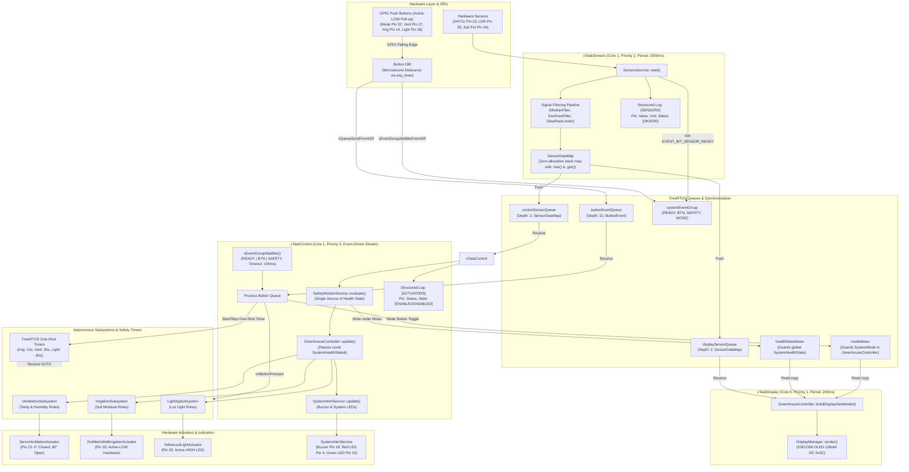

# Greenhouse Controller System Architecture, Data Flow & Schemas

This document contains the official architecture diagrams, data flow schemas, decision tree logic, core data structure schemas, and safety logic audit for the **ESP32 Greenhouse Controller**, updated through **Phases 0 to 10** of the refactoring.

---

## 1. System Data Flow Diagram (Mermaid Schema)



---

## 2. Decision Branch & Control Loop Diagram (Mermaid Schema)

```mermaid
flowchart TD
    Start(["vTaskControl Cycle (100ms Timeout)"]) --> WaitEvt["xEventGroupWaitBits(READY | BTN | SAFETY)"]
    
    WaitEvt --> CheckBtn{"Button Queue Empty?"}
    CheckBtn -->|No| PopBtn["Pop ButtonEvent from Queue"]
    PopBtn --> BtnType{"Button Type?"}
    
    BtnType -->|ButtonType::MODE| ToggleSysMode["Acquire modeMutex\nToggle SystemMode (AUTO <-> MANUAL)\nCancel All Active Safety Timers\nReset Subsystem manualState to OFF (if AUTO)\nRelease modeMutex\nSet EVENT_BIT_MODE_CHANGED"]
    
    BtnType -->|Actuator Button| BtnPress["GreenhouseController::onButtonPressed(type)"]
    BtnPress --> IsActActive{"Actuator Operating OR\nManualState == ON?"}
    
    IsActActive -->|Yes (Turn OFF)| BtnTurnOff["Set Subsystem Mode -> MANUAL\nSet ManualState -> OFF\nTurn Actuator OFF\nStop Active Safety Timer\n(Retains MANUAL/OFF to prevent auto-retrigger)"]
    IsActActive -->|No (Turn ON)| BtnTurnOn["Set Subsystem Mode -> MANUAL\nSet ManualState -> ON\nTurn Actuator ON\nIf Global Mode == AUTO:\n  Start One-Shot Safety Timer (10s/30s/60s)\nElse (MANUAL Mode):\n  Run Indefinitely until pressed again"]
    
    ToggleSysMode --> CheckBtn
    BtnTurnOff --> CheckBtn
    BtnTurnOn --> CheckBtn
    
    CheckBtn -->|Yes| PollSensors["Receive Latest SensorDataMap from controlSensorQueue"]
    PollSensors --> EvalSafety["SafetyMonitorService::evaluate(readings, isAutoMode)"]
    
    subgraph Safety_Priority_Evaluation["SafetyMonitorService Priority Cascade"]
        EvalSafety --> P1{"P1: Hardware Fault / NaN / Out-of-Bounds?"}
        P1 -->|Yes| SetErr["hasHardwareError = true\nrequiresAlarm = true\nAdvisory: 'SENSOR ERROR!'"]
        P1 -->|No| P2{"P2: Temp > 45°C?"}
        P2 -->|Yes| SetOverheat["hasCriticalHazard = true\nrequiresAlarm = true\nAdvisory: 'TEMP HIGH! Press VENT'"]
        P2 -->|No| P3{"P3: Temp < 5°C?"}
        P3 -->|Yes| SetFrost["hasCriticalHazard = true\nrequiresAlarm = true\nAdvisory: 'FROST RISK! Temp Low'"]
        P3 -->|No| P4{"P4: Soil > 85%?"}
        P4 -->|Yes| SetFlood["hasCriticalHazard = true\nrequiresAlarm = true\nAdvisory: 'SOIL FLOOD! Stop Water'"]
        P4 -->|No| P5{"P5: Humid > 85%?"}
        P5 -->|Yes| SetHumid["hasOperatorAdvisory = true\nrequiresAlarm = false\nAdvisory: 'HUMID HIGH! Press VENT'"]
        P5 -->|No| P6{"P6: Soil < 30%?"}
        P6 -->|Yes| SetDry["hasOperatorAdvisory = true\nrequiresAlarm = false\nAdvisory: 'SOIL DRY! Press IRRIG'"]
        P6 -->|No| P7{"P7: Light > 25000 lx?"}
        P7 -->|Yes| SetLight["hasOperatorAdvisory = true\nrequiresAlarm = false\nAdvisory: 'LIGHT HIGH! Press LIGHT'"]
        P7 -->|No| SetNorm["Normal State (No Advisory)"]
    end
    
    SetErr --> SaveHealth["setGlobalHealthState(healthState)"]
    SetOverheat --> SaveHealth
    SetFrost --> SaveHealth
    SetFlood --> SaveHealth
    SetHumid --> SaveHealth
    SetDry --> SaveHealth
    SetLight --> SaveHealth
    SetNorm --> SaveHealth
    
    SaveHealth --> CtrlUpdate["GreenhouseController::update(isAutoMode, readings, const healthState)"]
    
    subgraph Subsystem_Graceful_Degradation["Sensor Presence & Degraded Mode Fallback"]
        CtrlUpdate --> CheckPresent{"readings.has(SensorType)?"}
        CheckPresent -->|Missing/Error| SubFallback["Fallback Subsystem to ControlMode::MANUAL\nEnforce Safe Actuator State (OFF / Closed)\nKeep Other Subsystems Running"]
        CheckPresent -->|Present| SubRun["Run Subsystem Rules with const SystemHealthState"]
    end
    
    subgraph Subsystem_Execution["Subsystem Update Rules"]
        SubRun --> CheckSubMode{"Subsystem ControlMode?"}
        CheckSubMode -->|MANUAL| EnforceManual["Enforce ManualState (ON / OFF)\nBypasses Automatic Rules\n[DOES NOT mutate healthState]"]
        CheckSubMode -->|AUTO| CheckHazards{"Critical Emergency Hazard?"}
        CheckHazards -->|Overheat > 45°C| ForceVentOpen["Ventilation: Force OPEN (90°)"]
        CheckHazards -->|Frost < 5°C| ForceVentClose["Ventilation: Force CLOSED (0°)"]
        CheckHazards -->|Soil Flood > 85%| ForceIrrigOff["Irrigation: Force OFF"]
        CheckHazards -->|None / Normal| AutoThresholds{"Check Auto Thresholds & Hysteresis"}
        AutoThresholds -->|Temp > 28°C or Hum > 70%| VentOpen["Ventilation: Open (Hysteresis: Closes < 26°C & < 65%)"]
        AutoThresholds -->|Soil <= 40%| IrrigOn["Irrigation: Turn ON (Hysteresis: Turns OFF > 45%)"]
        AutoThresholds -->|Light < 300 lx| LightOn["Lighting: Turn ON (Hysteresis: Turns OFF > 1000 lx)"]
    end
    
    SubFallback --> AlertUpdateStep["SystemAlertService::update(healthState)\n(Red LED on Error, Green LED on OK, Buzzer 1kHz on Alarm)"]
    EnforceManual --> AlertUpdateStep
    ForceVentOpen --> AlertUpdateStep
    ForceVentClose --> AlertUpdateStep
    ForceIrrigOff --> AlertUpdateStep
    VentOpen --> AlertUpdateStep
    IrrigOn --> AlertUpdateStep
    LightOn --> AlertUpdateStep
    
    AlertUpdateStep --> LogActState["Log Actuator Status [ENABLED/DISABLED] on change or sensor cycle"]
    LogActState --> EndCycle(["vTaskControl Cycle Complete"])
```

---

## 3. Data Structure Schemas

### 3.1 `SystemHealthState` Schema (`lib/Services/include/SafetyMonitorService.h`)
```cpp
struct SystemHealthState {
    bool hasHardwareError;     // True if any sensor reports isError, NaN, Inf, or out-of-bounds
    bool hasCriticalHazard;    // True if Overheat (>45°C), Frost (<5°C), or Soil Flood (>85%)
    bool hasOperatorAdvisory;  // True if High Humidity (>85%), Dry Soil (<30%), or High Light (>25000lx)
    bool requiresAlarm;        // True if 1kHz buzzer pulsed alarm should sound
    char advisoryMsg[64];      // Prioritized operator banner message (null-terminated string)
};
```

### 3.2 `DisplayViewModel` Schema (`lib/Services/include/DisplayViewModel.h`)
```cpp
struct DisplayViewModel {
    char modeText[8];       // "AUTO" or "MANUAL"
    char healthStatus[8];   // "[OK]" or "[ERR]"
    
    struct LineItem {
        char label[8];      // e.g. "Temp:", "Soil:", "Vent:"
        char value[10];     // e.g. "25.4C", "42.0%", "ON", "ERR"
    };

    LineItem sensors[4];    // Slot 0: Temp, 1: Hum, 2: Soil, 3: Light
    size_t sensorCount;

    LineItem actuators[4];  // Slot 0: Vent, 1: Irrig, 2: Light
    size_t actuatorCount;

    char advisoryBanner[24]; // Prioritized warning/advisory banner displayed on OLED
};
```

### 3.3 `ButtonEvent` & `ButtonType` Schema (`lib/Buttons/include/ButtonType.h`)
```cpp
enum class ButtonType {
    MODE = 0,
    IRRIGATION,
    VENTILATION,
    LIGHT
};

struct ButtonEvent {
    ButtonType type;        // Logical button category
    uint8_t buttonId;       // Hardware button index (1: Mode, 2: Irrig, 3: Vent, 4: Light)
    uint32_t timestamp;     // Microsecond/millisecond event timestamp
};
```

### 3.4 `SubsystemStatus` Schema (`lib/Subsystems/include/IControlSubsystem.h`)
```cpp
enum class SubsystemType {
    VENTILATION = 0,
    LIGHTING,
    IRRIGATION,
    UNKNOWN
};

enum class ControlMode {
    AUTO = 0,               // Governed by sensor thresholds and hysteresis
    MANUAL                  // Governed by manual button toggle override
};

enum class ManualState {
    OFF = 0,                // Manually commanded OFF
    ON                      // Manually commanded ON
};

struct SubsystemStatus {
    SubsystemType type;
    ControlMode mode;
    ManualState manualState;
    bool isActuatorOperating;
    bool activeAlarm;
};
```

### 3.5 `SensorDataMap` Schema (`lib/Sensors/include/SensorsService.h`)
```cpp
struct SensorDataEntry {
    Sensor* sensor;         // Pointer to registered HAL Sensor instance
    SensorData data;        // float value, uint32_t timestamp, bool isError
};

class SensorDataMap {
public:
    static constexpr size_t MAX_SENSORS = 4;

    bool has(SensorType type) const;            // Returns true only if sensor is registered AND !isError
    SensorData get(SensorType type) const;      // Returns reading or {0.0f, isError=true}
    size_t size() const;
    const SensorDataEntry& operator[](size_t index) const;
    // Fast array-backed stack storage with zero dynamic heap allocations during runtime
};
```

---

## 4. Safety Monitor Priority Evaluation Matrix

| Priority | Condition / Threshold | `hasHardwareError` | `hasCriticalHazard` | `hasOperatorAdvisory` | `requiresAlarm` | `advisoryMsg` Banner | System Action |
|---|---|---|---|---|---|---|---|
| **1 (Highest)** | Hardware Fault / NaN / Inf / Out-of-bounds | `true` | `false` | `false` | `true` | `"SENSOR ERROR!"` | Red LED ON, Buzzer ALARM, Degraded Subsystem -> MANUAL Safe |
| **2** | Temperature > 45.0°C (`CRITICAL_TEMP_HIGH`) | `false` | `true` | `false` | `true` | `"TEMP HIGH! Press VENT"` | Buzzer ALARM, Auto: Forces Vent Servo OPEN (90°) |
| **3** | Temperature < 5.0°C (`CRITICAL_TEMP_LOW`) | `false` | `true` | `false` | `true` | `"FROST RISK! Temp Low"` | Buzzer ALARM, Auto: Forces Vent Servo CLOSED (0°) |
| **4** | Soil Moisture > 85.0% (`CRITICAL_SOIL_HIGH`) | `false` | `true` | `false` | `true` | `"SOIL FLOOD! Stop Water"` | Buzzer ALARM, Auto & Manual: Forces Irrigation OFF |
| **5** | Air Humidity > 85.0% (`CRITICAL_HUMIDITY_HIGH`) | `false` | `false` | `true` | `false` | `"HUMID HIGH! Press VENT"` | Advisory Display, Auto: Opens Vent Servo |
| **6** | Soil Moisture < 30.0% (`CRITICAL_SOIL_LOW`) | `false` | `false` | `true` | `false` | `"SOIL DRY! Press IRRIG"` | Advisory Display, Auto: Irrigation triggers <= 40% |
| **7** | Light Intensity > 25000 lx (`CRITICAL_LIGHT_HIGH`) | `false` | `false` | `true` | `false` | `"LIGHT HIGH! Press LIGHT"`| Advisory Display |
| **8 (Lowest)** | All parameters within standard operational limits | `false` | `false` | `false` | `false` | `""` (Clear) | Green LED ON, Buzzer Silent |

---

## 5. Architectural Resolutions & Audit (Phases 0 - 10)

During development and live testing, several architectural bottlenecks, race conditions, and synchronization flaws were audited and systematically resolved:

### 1. `SystemHealthState` Immutability across Subsystems (Phase 4)
- **Previous Flaw**: `GreenhouseController::update()` passed non-const `SystemHealthState&` into subsystem updates, allowing subsystems to unconditionally overwrite `healthState.advisoryMsg` with lower-priority subsystem messages.
- **Resolution**: Subsystem update signatures now accept `const SystemHealthState&`. `SafetyMonitorService::evaluate()` is the strict single source of truth for health priority.

### 2. Per-Actuator Manual Overrides and Timer Lifecycles (Phases 2 & 3)
- **Previous Flaw**: Turning an actuator OFF via button kept mode in `AUTOMATIC`, causing the automatic sensor rule to immediately turn the actuator back ON on the next 100ms cycle. Additionally, global mode switches leaked running timers.
- **Resolution**:
  - **In `AUTOMATIC` Mode**:
    - Actuator button press (when OFF) turns actuator ON, sets subsystem to `ControlMode::MANUAL` / `ManualState::ON`, and starts a FreeRTOS one-shot safety timer (Irrig: 10s, Vent: 30s, Light: 60s).
    - When the safety timer expires, the callback sets `ManualState::OFF`, restores `ControlMode::AUTO`, and turns the actuator OFF.
    - Actuator button press (when ON) turns actuator OFF, stops the safety timer, and sets `ControlMode::MANUAL` / `ManualState::OFF`. This prevents auto rules from re-engaging until the user presses the button again or toggles global mode.
  - **In `MANUAL` Mode**:
    - Actuator buttons directly toggle `ManualState::ON` and `OFF` without starting any auto-shutoff timers.
  - **Global Mode Toggle**:
    - `setSystemMode()` explicitly cancels all running FreeRTOS actuator timers and resets manual states.

### 3. Centralized System Mode Ownership (Phase 1)
- **Previous Flaw**: `rtos_tasks.cpp` maintained a local static `currentMode` variable alongside `greenhouseController.getSystemMode()`, creating desynchronization risks.
- **Resolution**: Removed the shadow mode variable. `GreenhouseController` is the single owner of `globalSystemMode`, guarded by `modeMutex`.

### 4. Soil Moisture Threshold Deadband Gap (Phase 0)
- **Previous Flaw**: Soil dry threshold was 30% while the advisory alert was also 30%, leaving a deadband between 30% and 40% where irrigation did not run and no warning was provided.
- **Resolution**: Config aligned:
  - `SOIL_DRY_THRESHOLD = 40.0%` (Auto turn ON below 40%)
  - `SOIL_HYSTERESIS = 5.0%` (Auto turn OFF above 45%)
  - `CRITICAL_SOIL_LOW = 30.0%` (Manual advisory banner below 30%)
  - `CRITICAL_SOIL_DRY = 20.0%` (Critical hazard below 20%)

### 5. Graceful Degradation for Missing Sensors (Phase 5)
- **Previous Flaw**: If a sensor was unplugged or unconfigured, the system lacked a check and could cause crashes or silent misbehavior.
- **Resolution**: Implemented `SensorDataMap::has(SensorType)`. If a subsystem's sensor is missing or in hardware fault, that subsystem drops safely to `ControlMode::MANUAL` in an inactive safe state without blocking other subsystems.

### 6. Interrupt Safety & Debounce (Phases 7 & 8)
- **Previous Flaw**: `ButtonDriver::isrHandler` used Arduino `millis()` inside the ISR (non-atomic and prone to timer jitter) and executed blocking `ets_printf` calls.
- **Resolution**: ISR now queries `esp_timer_get_time() / 1000ULL` (64-bit microsecond hardware timer) for rock-solid debounce, eliminated all print calls inside the ISR, and removed recursive event group calls.

### 7. Structured ESP_LOG Logging with Tag Filtering (Phase 10)
- **Previous Flaw**: Scattered, unformatted `Serial.printf` calls clogged serial output and could not be filtered by component.
- **Resolution**: Unified structured logging via ESP-IDF `esp_log.h` (`ESP_LOGI`, `ESP_LOGD`, `ESP_LOGW`, `ESP_LOGE`) under tags `CONTROL`, `SENSORS`, `ACTUATORS`, `SAFETY`, `BUTTON`, `CONTROLLER`. Enabled `-D CORE_DEBUG_LEVEL=4` in `platformio.ini`. Added formatted actuator status reporting:
  `[ACTUATORS]   -> <Name> (Pin <Pin>): <StatusText> [<ENABLED|DISABLED>]`.

---

## 6. Hardware Pinout & Actuator Logic Reference Table

| Component Name | GPIO Pin | Hardware Direction | Logic Level | Safe Default State | Timeout in AUTO |
|---|---|---|---|---|---|
| **DHT11 Temp & Humidity** | GPIO 23 | Digital Bidirectional | Single-bus pulse | N/A | N/A |
| **LDR Light Sensor** | GPIO 35 | Analog Input (ADC1) | 0.0V - 3.3V (0 - 4095) | N/A | N/A |
| **Soil Potentiometer** | GPIO 34 | Analog Input (ADC1) | 0.0V - 3.3V (0 - 4095) | N/A | N/A |
| **Mode Button** | GPIO 32 | Digital Input | Pull-up (Active-LOW) | N/A | N/A |
| **Irrigation Button** | GPIO 14 | Digital Input | Pull-up (Active-LOW) | N/A | N/A |
| **Ventilation Button** | GPIO 27 | Digital Input | Pull-up (Active-LOW) | N/A | N/A |
| **Light Button** | GPIO 26 | Digital Input | Pull-up (Active-LOW) | N/A | N/A |
| **Buzzer** | GPIO 18 | Digital Output | Active-HIGH (Pulsed 1kHz) | OFF (Silent) | N/A |
| **Red LED (System Error)** | GPIO 4 | Digital Output | Active-HIGH | OFF | N/A |
| **Green LED (System OK)** | GPIO 15 | Digital Output | Active-HIGH | ON | N/A |
| **Ventilation Servo** | GPIO 13 | PWM / Servo Output | 50Hz PWM Pulse | Closed (0°) | 30 seconds |
| **8x8 Matrix Irrigation** | GPIO 33 | Digital Output | **Active-LOW** (LOW = ON) | OFF (Pin HIGH) | 10 seconds |
| **Yellow LED (Lighting)** | GPIO 25 | Digital Output | Active-HIGH (HIGH = ON) | OFF (Pin LOW) | 60 seconds |
| **SSD1306 OLED Display** | I2C (SDA/SCL) | I2C Bus | 0x3C Address | Initialized UI | N/A |
